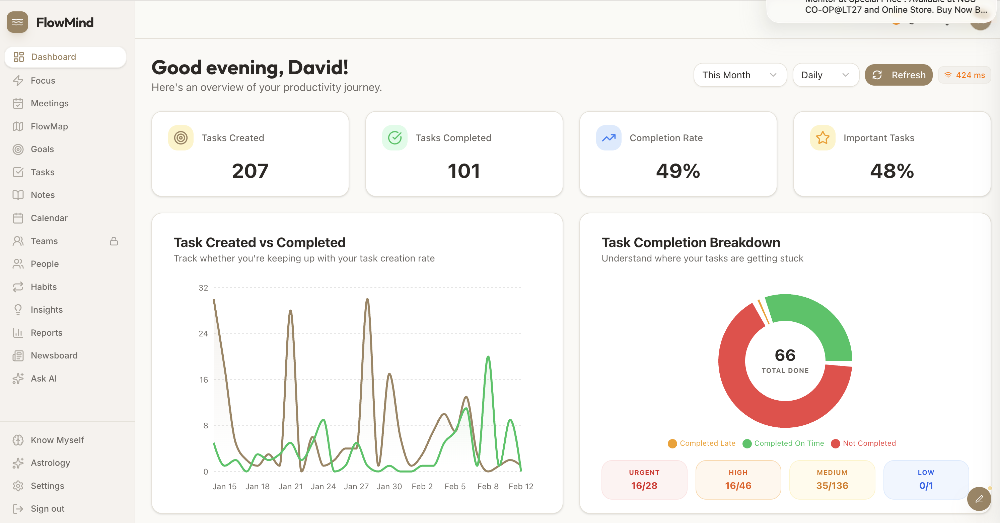
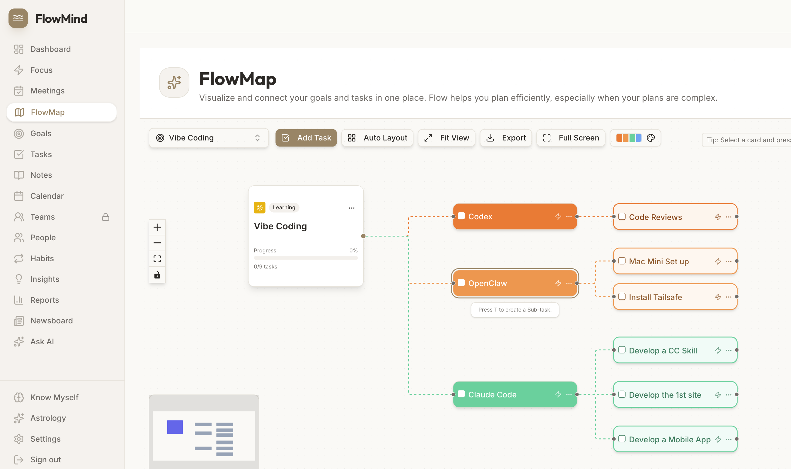

# FlowMind Skill for Claude Code

[](https://flowmind.life)
[](https://opensource.org/licenses/MIT)

Connect [Claude Code](https://docs.anthropic.com/en/docs/claude-code) to [FlowMind](https://flowmind.life) — your personal productivity platform for goals, tasks, notes, people, and tags.

## Flowmind

Flowmind is a powerful platform designed to help you manage your goals and tasks with clarity and focus. It also integrates seamlessly with AI bots, giving you a unified space to coordinate both human and automated work.

You can easily connect your bots, such as OpenClaw, to Flowmind and track their activities in real time. Monitor progress, review outputs, and stay in control of every job from a single, organized dashboard.

**Create an account**
https://flowmind.life/


*Dashboard — Track your productivity journey*


*FlowMap — Visualize goals and tasks*

## Features

- 🎯 **Goals** — Create and track goals with categories and progress
- ✅ **Tasks** — Manage tasks with priorities, due dates, and subtasks
- 📝 **Notes** — Capture ideas and information
- 👥 **People** — Manage contacts and relationships
- 🏷️ **Tags** — Organize with custom tags

## Installation

```bash
/plugin marketplace add haohappy/cc-skill-flowmind
/plugin install flowmind@cc-skill-flowmind
```

## Setup

1. Go to [FlowMind](https://flowmind.life) and sign in
2. Click your avatar → **Settings** → **API Keys**
3. Click **Generate New Key** and copy it (starts with `fm_`)
4. Configure the skill:

```bash
mkdir -p ~/.flowmind
echo '{"api_key": "fm_YOUR_KEY", "base_url": "https://flowmind.life/api/v1"}' > ~/.flowmind/config.json
```

## Usage

```bash
# Help
/flowmind help                    # Show all commands
/flowmind help tasks              # Show task options

# Goals
/flowmind list goals
/flowmind add goal "Launch MVP" --category business --target 2025-03-01
/flowmind get goal <id>
/flowmind update goal <id> --progress 50
/flowmind delete goal <id>

# Tasks
/flowmind list tasks --status todo
/flowmind add task "Review report" --priority high --due 2025-01-15
/flowmind get task <id>
/flowmind update task <id> --status completed
/flowmind delete task <id>
/flowmind add subtask <parent_id> "Subtask title"

# Notes
/flowmind list notes
/flowmind add note "Meeting notes" --content "Discussion points..."
/flowmind get note <id>
/flowmind update note <id> --content "Updated content"
/flowmind delete note <id>

# People
/flowmind list people
/flowmind add person "John Doe" --email john@example.com --relationship colleague
/flowmind get person <id>
/flowmind update person <id> --company "Acme Inc"
/flowmind delete person <id>

# Tags
/flowmind list tags
/flowmind add tag "urgent" --color "#ff0000"
/flowmind delete tag <id>
```

## Commands

### Goals
| Command | Description |
|---------|-------------|
| `list goals` | List all goals |
| `add goal <title>` | Create a goal |
| `get goal <id>` | Get goal details |
| `update goal <id>` | Update a goal |
| `delete goal <id>` | Delete a goal |

### Tasks
| Command | Description |
|---------|-------------|
| `list tasks` | List all tasks |
| `add task <title>` | Create a task |
| `get task <id>` | Get task details |
| `update task <id>` | Update a task |
| `delete task <id>` | Delete a task |
| `list subtasks <id>` | List subtasks |
| `add subtask <id> <title>` | Create subtask |

### Notes
| Command | Description |
|---------|-------------|
| `list notes` | List all notes |
| `add note <title>` | Create a note |
| `get note <id>` | Get note details |
| `update note <id>` | Update a note |
| `delete note <id>` | Delete a note |

### People
| Command | Description |
|---------|-------------|
| `list people` | List all people |
| `add person <name>` | Create a person |
| `get person <id>` | Get person details |
| `update person <id>` | Update a person |
| `delete person <id>` | Delete a person |

### Tags
| Command | Description |
|---------|-------------|
| `list tags` | List all tags |
| `add tag <name>` | Create a tag |
| `delete tag <id>` | Delete a tag |

## Options

### Goal Options
| Option | Values |
|--------|--------|
| `--description` | Goal description |
| `--category` | business, career, health, personal, learning, financial |
| `--target` | Target date (YYYY-MM-DD) |
| `--status` | active, completed, archived |
| `--progress` | 0-100 |

### Task Options
| Option | Values |
|--------|--------|
| `--description` | Task description |
| `--priority` | low, medium, high, urgent |
| `--status` | todo, in_progress, completed, archived |
| `--energy` | low, medium, high |
| `--due` | Due date (YYYY-MM-DD) |
| `--goal` | Link to goal ID |
| `--person` | Link to person ID |

### Person Options
| Option | Values |
|--------|--------|
| `--email` | Email address |
| `--phone` | Phone number |
| `--company` | Company name |
| `--role` | Job title |
| `--relationship` | business, colleague, friend, family, mentor, client, partner, other |

## Links

- [FlowMind](https://flowmind.life)
- [API Documentation](https://docs.flowmind.life)
- [GitHub Issues](https://github.com/haohappy/cc-skill-flowmind/issues)

## License

MIT
